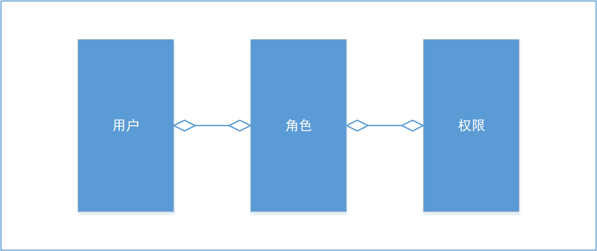
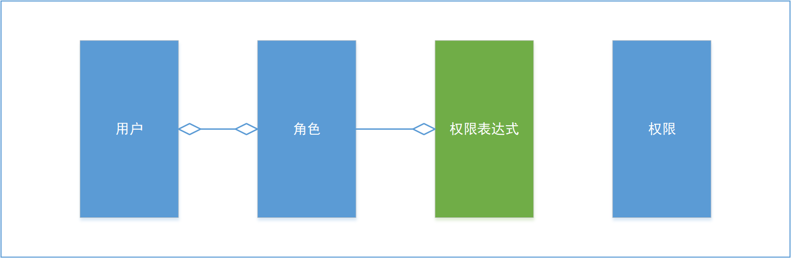
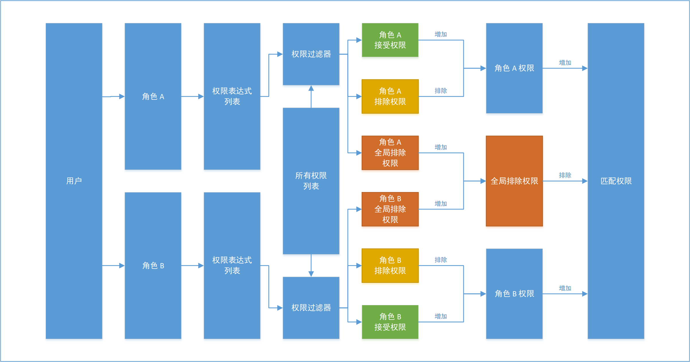

# Pexp General - 权限表达的通用概念

## 说明

本文详细说明了权限表达式的概念，原理，以及为何使用权限表达式。

您可以通过本文档了解项目中权限表达式的通用逻辑和相关概念。

目前（1.8.0.a）为止，权限表达式一共有 2 代，其语法逻辑有一定的区别，
您可以在 [参阅](#参阅) 章节中跳转到相关文档，详细了解对应的语法细节。

## 什么是权限表达式

权限表达式 `Pexp(Permission Expression)` 是本项目中的一个实体。它与角色 `Role` 存在一对多关联，即一个角色可关联多个
`Pexp`。

在传统的 RBAC 实体关系中，用户、角色、权限三张表为多对多关联，如下图所示：

权限表达式在传统 RBAC 的实体基础上，断开角色与权限的多对多关联，并在此基础上，添加 `Pexp` 实体，使 角色与 `Pexp` 实体进行一对多关联，
如下图所示

权限表达式实体如下：

| 字段类型        | 字段名称    | 字段描述  |
|:------------|:--------|:------|
| LongIdKey   | key     | 主键    |
| StringIdKey | roleKey | 角色外键  |
| String      | content | 表达式内容 |
| String      | remark  | 备注    |

## 为什么使用权限表达式

在传统的 RBAC 模型中，角色与权限基于多对多的中间表进行关联，这与角色和权限的关联直觉不符。
在常规的认知中，角色与权限的关联，应该是遵循某种更通用的规律，如：

- 超级管理员角色应该具有系统中的所有权限。
- 普通角色应具有业务相关的权限。
- 访客应具有只读权限。

上述例子中可以看出，角色和权限的关联关系，应该遵循一种更泛用的规律，而不是像多对多关联那样，为所有的权限设置角色的关联关系。
多对多的中间表关联，容易造成维护的混乱和不稳定，为角色建立全部的权限关联时，很容易错过或意外添加权限关联。

一个系统随着功能的增加，其权限节点也是在不断增加的，如果使用多对多中间表的关联，在增加权限节点时，必须对新的权限手动指定角色关联。
而权限表达式则可以基于权限匹配逻辑，自动匹配角色关联。

使用多对多中间表的关联，会产生大量关联数据，难以维护。在实战中，使用权限表达式，
一个模块的权限往往不超过两条表达式即可配置完成（一条前端表达式，一条后端表达式）。

使用多对多中间表的关联，只能表示一个角色和一个权限的关联关系（拥有关联/没有关联），而在实际使用时，情况往往会更复杂，试想：

- 我需要设置一个被封禁的角色，只要用户有这个角色，那么用户就没有任何权限，即使用户还属于其它角色。

在上述场景中，受制于关联关系的表示，多对多中间表的关联无法实现上述的需求。
使用权限表达式，开发人员可以灵活配置表达式的修饰符，轻松实现上述需求。

## 权限查询工作流程

基于权限表达式的用户权限查询工作流程如下：

1. 与传统的 RBAC 模型一致，首先查询出和用户相关的所有角色。
2. 查询到每个角色对应的权限表达式列表。
3. 根据每个角色的权限表达式生成权限过滤器，对所有权限进行过滤，并生成接受列表、排除列表、全局排除列表。
4. 每个角色的权限接受列表与排除列表作差，形成每个角色的权限列表。
5. 每个角色的全局排除列表求和，变成最终全局排除列表。
6. 每个角色的权限列表求和，并减去最终全局排除列表，获得最终的匹配权限。

可以发现，基于权限表达式的权限查询具有更强大的功能，可以通过更少的配置实现权限控制需求。
在性能方面，由于业务逻辑处理更复杂（尤其是高级的权限过滤器会消耗更长时间），基于权限表达式的权限查询比多对多的权限查询性能更低，
但本项目使用了一系列的手段，尽可能的提高了查询的性能。

- 权限表达式生成权限过滤器的时候，项目提供了本地缓存，减少了实例化对象造成的开销。
- 用户的权限查询完毕后，其对应的权限列表会被缓存至 redis，由于用户的权限数据是稳定的，因此该缓存可大幅提高查询性能。

## 权限的接受程度

一个权限通过基于权限表达式生成的权限过滤器进行测试，最终可分为四类接受程度：

1. `NOT_ACCEPT`: 接受程度 - 未通过。该接受程度代表权限没有通过权限过滤器的测试，不会进入后续逻辑处理环节。
2. `ACCEPT`: 接受程度 - 接受。该接受程度的权限会在后续处理中被添加至角色的接受列表中。
3. `REJECT`: 接受程度 - 拒绝。该接受程度的权限会在后续处理中被添加至角色的排除列表中。
4. `GLOBAL_REJECT`: 接受程度 - 全局拒绝。该接受程度的权限会在后续处理中被添加至角色的全局排除列表中。

以下为一个例子：

一个用户有两个角色，系统中有四个权限，经权限过滤器处理，最终接受程度如下：

| 角色  | 权限           | 接受程度          |
|:----|:-------------|:--------------|
| foo | permission.1 | NOT_ACCEPT    |
| foo | permission.2 | ACCEPT        |
| foo | permission.3 | ACCEPT        |
| foo | permission.4 | REJECT        |
| bar | permission.1 | ACCEPT        |
| bar | permission.2 | REJECT        |
| bar | permission.3 | GLOBAL_REJECT |
| bar | permission.4 | NOT_ACCEPT    |

该用户最终拥有的权限为：

| 序号 | 权限           |
|:---|:-------------|
| 1  | permission.1 |
| 2  | permission.2 |

解释：

- 对于 `permission.1`，其在 `foo` 角色中的接受程度为 `NOT_ACCEPT`，故不参与 `foo` 角色的后续处理；
  其在 `bar` 角色中的接受程度为 `ACCEPT`，被添加至 `bar` 角色的接受列表中，因此，用户的最终权限列表中包含该权限。
- 对于 `permission.2`，其在 `foo` 角色中的接受程度为 `ACCEPT`，被添加至 `foo` 角色的接受列表；
  在 `bar` 角色中的接受程度为 `REJECT`，被添加至 `bar` 角色的排除列表中，因此，用户最终权限列表中包含该权限。
- 对于 `permission.3`，其在 `foo` 角色中的接受程度为 `ACCEPT`，被添加至 `foo` 角色的接受列表；
  在 `bar` 角色中的接受程度为 `GLOBAL_REJECT`，被添加至全局排除列表中，因此，用户最终权限列表中不包含该权限。
- 对于 `permission.4`，其在 `foo` 角色中的接受程度为 `REJECT`，被添加至 `foo` 角色的排除列表中；
  在 `bar` 角色中的接受程度为 `NOT_ACCEPT`，不参与 `bar` 角色的后续处理，因此，用户最终权限列表中不包含该权限。

## 参阅

- [Pexp V1](./PexpV1.md) - 权限表达式 V1 说明文档。权限表达式 V1 可提供单一逻辑权限匹配工功能。
- [Pexp V2](./PexpV2.md) - 权限表达式 V2 说明文档。权限表达式 V2 可提供复合逻辑权限匹配功能。
